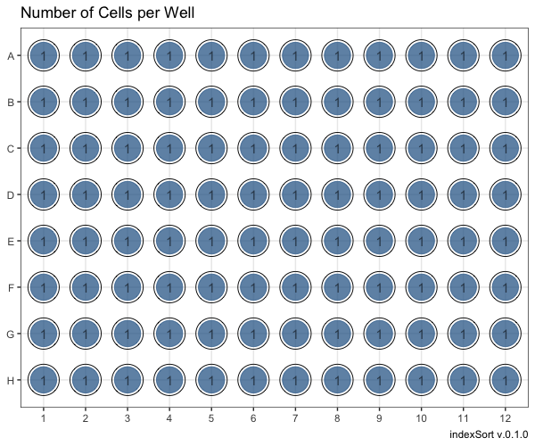

# indexSort

## Overview

This package contains functions to retrieve index sorted data and visually explore .fcs date files from various cell sorters.

## Installation

You can install the development version from GitHub with `devtools`:

``` r
install.packages("devtools")
devtools::install_github("Kawameicha/indexSort")
```

## Features

* Retrieve index sorted data with `retrieve_index()` currently supported for:
  * BD FACSAriaIII<sup>TM</sup>
  * BD FACSAria Fusion<sup>TM</sup>
  * BD FACSymphony S6<sup>TM</sup>
  * BD Influx<sup>TM</sup>
  * BD FACSJazz<sup>TM</sup>
  * MoFlo Astrios<sup>TM</sup>
* Display median fluorescence and number of cells per well with `explore_plate()`.



## Usage 

``` r
library(tidyverse)
library(flowCore)
library(indexSort)

inputFCS <- read.FCS("~/path/to/file.fcs")
result <- retrieve_index(inputFCS)
explore_plate(result, vars = c("APC.A", "FITC.A", "Pacific.Blue.A", "Time"))
```

## Community Guidelines

This project is released with a [Code of Conduct](https://github.com/Kawameicha/indexSort/blob/master/CODE_OF_CONDUCT.md). By participating in this project you agree to abide by its terms. Feedback, bug reports (and fixes!), and feature requests are welcome; file issues or seek support [here](http://github.com/Kawameicha/indexSort/issues).

## License

[Apache 2.0](https://opensource.org/licenses/Apache-2.0) © Christoph Freier
